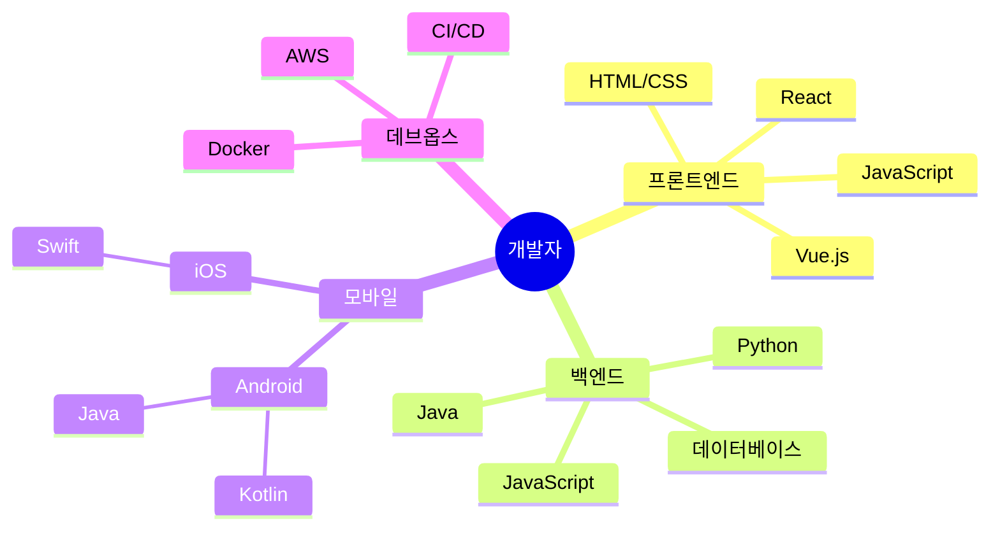

# 개발자: 디지털 세상을 만드는 창작자

## 1. 개발자란?
여러분이 매일 사용하는 카카오톡, 인스타그램, 유튜브와 같은 앱이나 웹사이트는 모두 개발자들이 만든 작품입니다. 개발자는 우리가 사용하는 모든 디지털 서비스와 프로그램을 만드는 직업이에요.

## 2. 개발자가 하는 일
개발자는 마치 레고 블록으로 집을 짓듯이, 프로그래밍 언어라는 도구를 사용해 다양한 디지털 제품을 만듭니다. 프로그래밍 언어란 컴퓨터에게 지시를 내리기 위한 명령어입니다. 여러분 모두가 사용할 수 있는 툴로 간단하게 실습해보는 시간을 가져보도록 하겠습니다. 실습을 위해 `about:blank` 페이지를 열어주세요. 그리고 `F12` 키를 눌러 개발자 도구를 열어주세요. 이제 아래 코드를 입력해보세요.

```javascript
alert('안녕하세요, 여러분!');
```

### 2.1 주요 업무
- 새로운 웹/앱 서비스 개발
- 기존 서비스 개선 및 유지보수
- 사용자 피드백을 반영한 기능 업데이트
- GitHub 등을 활용한 소스 코드 관리
- 팀원들과 협업하는 프로젝트 진행

### 2.2 개발자가 사용하는 주요 툴
- 코드 편집기와 IDE: Visual Studio Code(VSCode), IntelliJ, PyCharm 등
- 버전 관리 시스템: Git 및 GitHub/GitLab
- 프로젝트 관리 툴: Jira, Trello
- 디자인 협업 툴: Figma, Adobe XD

## 3. 개발자의 종류



### 3.1 프론트엔드 개발자
- 사용자가 직접 보고 사용하는 화면을 만듭니다.
- 인스타그램의 피드나 카카오톡의 채팅창 같은 것들을 디자인하고 만들어요.
```html
<!DOCTYPE html>
<html>
<head>
  <title>나의 첫 웹 페이지</title>
</head>
<body>
  <h1>안녕하세요, 여러분!</h1>
  <p>첫 웹 페이지를 만들어보았습니다.</p>
</body>
</html>
```

### 3.2 백엔드 개발자
- 사용자에게 보이지 않는 서버와 데이터베이스를 관리합니다.
- 카카오톡 메시지가 상대방에게 전달되는 과정을 처리하는 것과 같은 일을 해요.

```python
from http.server import HTTPServer, SimpleHTTPRequestHandler


class MyHandler(SimpleHTTPRequestHandler):
    def do_GET(self):
        # /, /a, /b의 요청을 처리하는 코드
        if self.path == "/":
            self.send_response(200)
            self.end_headers()
            self.wfile.write(b"<h1>Hello, World!</h1>")
        elif self.path == "/a":
            self.send_response(200)
            self.end_headers()
            self.wfile.write(b"<h1>Hello, A!</h1>")
        elif self.path == "/b":
            self.send_response(200)
            self.end_headers()
            self.wfile.write(b"<h1>Hello, B!</h1>")


httpd = HTTPServer(("localhost", 8000), MyHandler)

httpd.serve_forever()
```


### 3.3 모바일 앱 개발자
- 스마트폰에서 사용하는 앱을 만듭니다.
- 안드로이드나 아이폰 앱을 개발해요.

[expo](https://snack.expo.dev/)


```jsx
export default function App() {
  return (
    <SafeAreaView style={styles.container}>
      <Text style={styles.paragraph}>
        hi
      </Text>
      <Text style={styles.paragraph}>
        hello
      </Text>
      <Card>
        <AssetExample />
      </Card>
    </SafeAreaView>
  );
}
```

```jsx
import React, {Component} from 'react';
import {StyleSheet, Text, View} from 'react-native';
export default class App extends Component<Props> {
  render() {
    return (
      <View style={styles.container}>
        <View style={styles.case1} />
        <View style={styles.case2} />
        <View style={styles.case3} />
      </View>
    );
  }
}

const styles = StyleSheet.create({
  container: {
    flex: 1,
    backgroundColor: 'white',
  },
  case1: {
    flex: 1,
    backgroundColor: 'red',
  },
  case2: {
    flex: 2,
    backgroundColor: 'green',
  },
  case3: {
    flex: 1,
    backgroundColor: 'blue',
  },
});
```

## 4. 전공 및 준비과정
### 4.1 추천 전공
- 컴퓨터공학과
- 소프트웨어학과
- 정보통신공학과
- 컴퓨터과학과

### 4.2 주력 스택 정하기
- 주력 스택을 정해 해당 기술에 집중하는 것이 좋음
- 개인적으로 BE는 Python과 Django, FastAPI를 추천
- 개인적으로 FE는 JavaScript와 React를 추천
- [가장 인기 있는 언어](https://www.tiobe.com/tiobe-index/)
- 언어는 유행을 타지만 기본기는 거의 변하지 않음(자료구조나 알고리즘 등)
- 프레임웤이나 라이브러리는 유행을 타지만 기본기는 거의 변하지 않음(네트워크, 운영체제, 파일구조 등)

### 4.2 추천 활동 및 경진대회
- 소프트웨어 경진대회 참가
- 해커톤 참가
- 오픈소스 프로젝트 참여
- 코딩 동아리 활동

### 4.3 자격증
- 정보처리기사
- AWS

### 4.2 준비 방법
1. 코딩 기초 배우기
    - 위니북스, 제주코딩베이스캠프 등 무료 온라인 강좌로 시작해보기
    - [30분 요약강좌](https://inf.run/KaAS) 등 가능하면 짧게 경험해보고 더 깊게 공부하기
    - 가장 많이 사용하는 Python이나 JavaScript 같은 기초 프로그래밍 언어 배우기

2. 프로젝트 경험 쌓기
    - 간단한 웹사이트나 앱 만들어보기
    - 깃허브에 자신의 코드 저장하고 공유하기

3. 분야를 정해 깊이 공부하기
    - 프론트엔드, 백엔드, 모바일 앱 중 하나를 선택해 전문가가 되기
    - 관련 분야의 책이나 강좌를 통해 심화 학습하기

## 5. 취업 전망
- 디지털 전환으로 인해 수요가 계속 증가하는 추세
- AI로 인해 실제 인력 부족 문제가 해결될지, 해결되지 않을지는 지켜봐야 함
- 25년, 아직은 통계수치로 12대 산업군 중 가장 부족한 직종으로 꼽힘
- 대기업, 스타트업, 프리랜서 등 다양한 진로 선택 가능
- 프리랜서로 전환하여 독립적인 업무 환경 선택 가능
- 평균 연봉은 신입 기준 3,500 ~ 4,500만원 수준
- 경력이 쌓일수록 높은 연봉 상승 가능
- 대기업과 스타트업 외에도 공공기관, 연구소, 그리고 비영리 기술 단체 등 다양한 진로가 있음
- 채용시장은 프론트엔드 개발자가 가장 높은 수요를 보이고 있음

## 6. 위니브 현직자 조언
- "코딩이 처음부터 완벽할 필요는 없어요. 작은 것부터 시작해서 하나씩 배워가면 됩니다. 중요한 건 무엇을 배우겠냐가 아니라 무엇을 만들겠냐는 것입니다."
- "개발자는 혼자서 일하기보다는 팀으로 일하는 경우가 많아요. 그래서 협업 능력도 중요합니다."
- "코딩은 끝이 없는 공부라고 할 수 있어요. 파이썬을 창시한 귀도 반 로섬도 10점 만점에 8점이라 자신을 평가했죠. 새로운 기술이 계속해서 나오기 때문에 배움에 대한 열정이 있어야 합니다."

## 7. 개발자의 성장 단계
1. 주니어 개발자 (1-3년)
   - 기본적인 코딩 능력 습득
   - 선임 개발자의 지도 아래 업무 수행
2. 중급 개발자 (4-7년)
   - 독립적인 프로젝트 수행 가능
   - 주니어 개발자 멘토링
3. 시니어 개발자 (8년 이상)
   - 아키텍처 설계 및 기술 결정
   - 팀 리딩 및 프로젝트 관리

## 8. AI 시대의 개발자
- AI 도구(GitHub Copilot 등)를 활용한 생산성 향상
- AI와의 협업 능력이 중요해짐
- 새로운 AI 기술 학습의 필요성
- 기술을 빠르게 배워 적용할 수 있는 짧은 러닝커브를 지니는 것이 중요